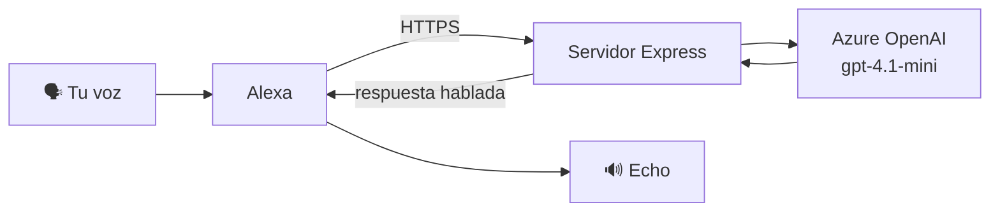

<h1 align="center">🎙️ Jarvis</h1>

<p align="center">
  <em>Convierte tu Echo en un asistente con el que de verdad se puede <strong>platicar</strong>.</em><br/>
  Le hablas normal, te sigue el hilo, le cambias de tema sin repetir "Alexa" — y cuando te despides, se calla solo.
</p>

<p align="center">
  
  
  
  
  
  
</p>

> **La idea.** Alexa de fábrica es de comandos sueltos: "pon una alarma", "qué clima hace".
> Jarvis la vuelve **conversacional** — como abrir el micro de ChatGPT o Gemini, pero saliendo
> de tu bocina del Echo, en español y con personalidad.

---

## ✨ Highlights

- 🗣️ **Charla de corrido** — después de cada respuesta el micro sigue abierto; le hablas natural, sin frases mágicas tipo *"pregúntale a Jarvis..."*.
- 🧠 **Con memoria** — recuerda lo que se dijo antes en la sesión y le da continuidad (le puedes decir *"y eso por qué?"* y sabe de qué hablas).
- 👋 **Cierre natural** — detecta cuando te despides (*"gracias, adiós"*) y termina la sesión de verdad, sin quedarse en bucle.
- ⚡ **Respuesta al instante** — suelta una muletilla (*"Claro", "Va", "A ver"*) mientras piensa, para que nunca se sienta muerto ni corte por el límite de ~8s de Alexa.
- 🎭 **Personalidad** — tono cálido, mexicano y breve, definido en un solo *system prompt* fácil de tunear.
- 🔒 **Sin llaves en el repo** — credenciales por `config.js` (ignorado) o variables de entorno.

---

## 🧩 Cómo funciona

Alexa manda cada interacción como una petición HTTP; el servidor la resuelve con Azure OpenAI y responde por voz.



Tres detalles hacen que se sienta conversación y no una skill normal:

| Pieza | Qué hace |
|---|---|
| **Slot libre** (`Dialog.ElicitSlot`) | Alexa toma lo *siguiente* que digas como la pregunta completa, sin carrier phrases. Necesita un `dialog model` en el modelo de interacción. |
| **Memoria por sesión** | Historial de la charla en memoria, indexado por `sessionId`, inyectado en cada respuesta. |
| **Marca de despedida** | El modelo agrega una etiqueta `[FIN]` cuando la persona se despide; ahí se cierra la sesión. |

---

## 💬 Se oye así

```text
Tú     — Alexa, abre Jarvis
Jarvis — ¡Hola! Soy Jarvis. ¿De qué platicamos?
Tú     — ¿qué es una computadora cuántica?
Jarvis — Es una compu que usa las reglas de la física cuántica para
         hacer cálculos que a una normal le tomarían siglos. ¿Te late
         que te lo aterrice con un ejemplo?
Tú     — sí porfa
Jarvis — Imagínate abrir un laberinto y probar todos los caminos a la
         vez en vez de uno por uno. Eso, más o menos.
Tú     — jaja va, gracias
Jarvis — ¡Un placer! Aquí ando cuando quieras. 👋  (cierra la sesión)
```

---

## 🚀 Correr en local

Requisitos: **Node 18+**, una skill de Alexa tipo *Custom* (endpoint propio) y un recurso de **Azure OpenAI** con un deployment.

```bash
npm install
cp config.example.js config.js   # pon tus credenciales de Azure
npm start                         # servidor en el puerto 3000
```

Alexa necesita un endpoint **HTTPS público**, así que expón el puerto local con un túnel:

```bash
cloudflared tunnel --url http://localhost:3000
```

Copia la URL `https://...` y ponla como endpoint de la skill (**Build → Endpoint**, certificado *Wildcard*).

---

## 🛠️ Stack

| Área | Tecnología |
|------|------------|
| Runtime | **Node.js** + **Express 5** |
| Skill | **ask-sdk-core** + **ask-sdk-express-adapter** |
| Cerebro | **Azure OpenAI** (`gpt-4.1-mini`) |
| Túnel | **cloudflared** (endpoint HTTPS público) |
| Voz | STT/TTS nativos de **Alexa** (es-MX / es-US) |

---

## ⚙️ Configuración

`config.js` (ignorado por git) o variables de entorno:

| Variable | Descripción |
|---|---|
| `AZURE_OPENAI_API_KEY` | Llave del recurso de Azure OpenAI |
| `AZURE_OPENAI_ENDPOINT` | `https://TU-RECURSO.openai.azure.com/` |
| `AZURE_OPENAI_API_VERSION` | Por defecto `2024-10-21` |
| `AZURE_OPENAI_DEPLOYMENT` | Nombre del deployment, ej. `gpt-4.1-mini` |
| `PORT` | Puerto del servidor (default `3000`) |
| `VERIFY_SIGNATURE` | `false` para saltar la verificación de firma en local |

---

## 📁 Estructura

```
.
├── server.js              # servidor de la skill (handlers + cerebro)
├── config.example.js      # plantilla de credenciales
└── skill-package/
    ├── skill.json         # manifiesto de la skill
    └── interactionModels/  # modelo de interacción (es-MX / es-US)
```

El modelo de interacción define el `invocationName` (`jarvis`), el intent `AskIntent` con
un slot `query` (`AMAZON.SearchQuery`) y el `dialog` model con `delegationStrategy: SKILL_RESPONSE`
— sin ese `dialog`, el directivo `ElicitSlot` no es válido y Alexa cierra la sesión.

Desplegar el modelo con el ASK CLI:

```bash
ask smapi set-interaction-model -s <skill-id> -g development -l es-MX \
  --interaction-model file:skill-package/interactionModels/custom/es-MX.json
```

---

## 🗺️ Roadmap

- [ ] Hosting 24/7 (hoy depende de tener servidor + túnel corriendo).
- [ ] Memoria persistente entre sesiones, no solo dentro de una charla.
- [ ] Control de casa inteligente (luces, dispositivos).
- [ ] Recordatorios, timers y agenda.

---

<p align="center"><sub>Proyecto personal · hecho por gusto para que la Alexa deje de ser tan tonta 🤖</sub></p>
